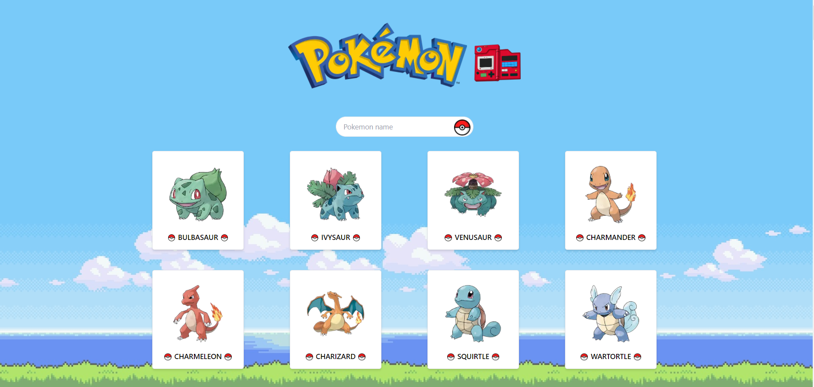

# Pokemon Pokedex


<br>
<br>

## Technology Used

1. Next.js
2. Tailwindcss
3. Typescript
<br>
<br>

## How to start the project ?

```
npm install
npm run dev
```
<br>

## API used
Website - https://pokeapi.co/

API Endpoint - https://pokeapi.co/api/v2/pokemon?limit=151  
- 1st Generation Pokemon

<br>
<br>

## Typescript Definition
Website - https://jvilk.com/MakeTypes/
- Helps to create type definition easier when preparing types for data that has many information.